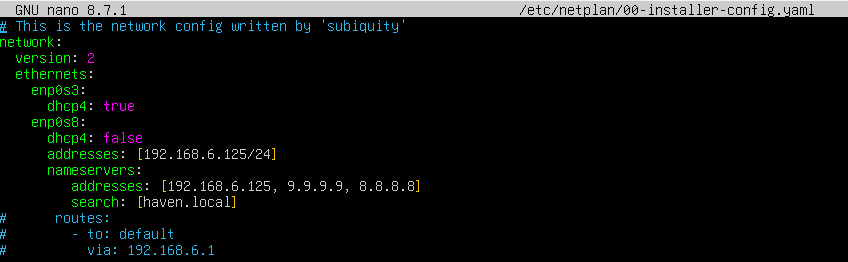
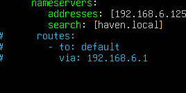
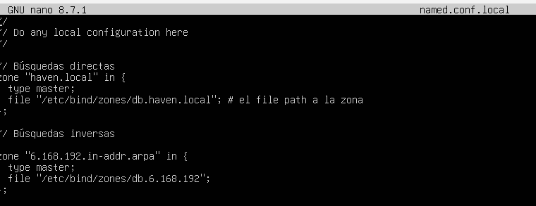
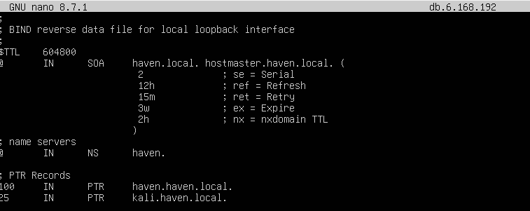
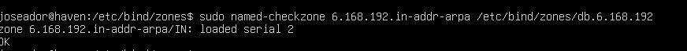
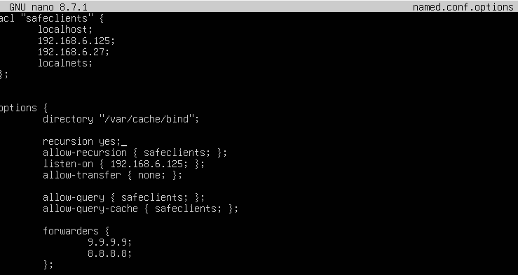
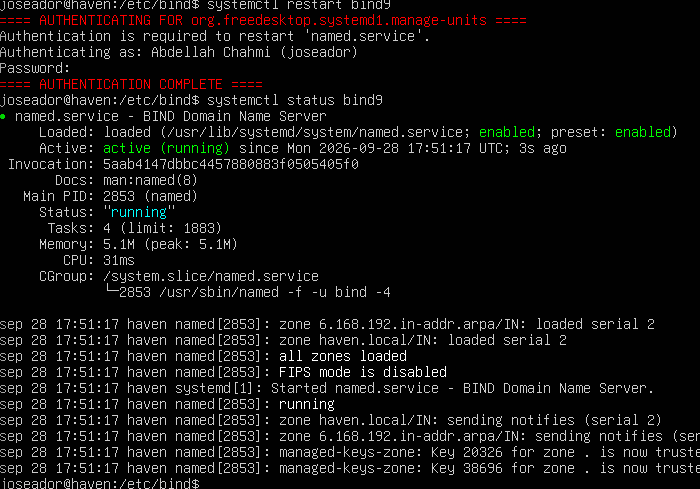

# Configurar un servidor DNS en Ubuntu Server

Aquí explicaré cómo configurar un servidor DNS en una máquina UBUNTU SERVER 26.04.1

## 1. Actualizar el sistema

Primero, después de haber creado la máquina y configurado el nombre, empezamos por hacer un `sudo apt update`:

```bash
sudo apt update
```

## 2. Configurar la red (Netplan)

Después entré en el archivo de configuración de red de Netplan:

```bash
sudo nano /etc/netplan/00-installer-config.yaml
```

Y dejé esta configuración:



### Por qué lo configuré de esta manera

La máquina tiene **dos adaptadores de red**:

- **Primer adaptador (`enp0s3`), en modo NAT:** lo uso para que el servidor tenga salida a Internet (por ejemplo, para descargar paquetes). Como el NAT de VirtualBox reparte la IP automáticamente, tuve que ponerlo en **DHCP** (`dhcp4: true`).
- **Segundo adaptador (`enp0s8`), en modo Red interna:** es la red por la que el servidor DNS dará servicio a los demás equipos. Aquí no hay DHCP (`dhcp4: false`), así que le puse una **IP fija**: `192.168.6.125/24`.

### Problema con `routes` y cómo lo arreglé

Al principio tenía puesta en el segundo adaptador una **ruta por defecto** (`routes` → `to: default` → `via: 192.168.6.1`). Eso me daba problemas por dos motivos:

1. **Esa puerta de enlace no existe.** La red interna es una red aislada donde no hay ningún router en `192.168.6.1`. Con esa ruta, el servidor mandaba el tráfico hacia Internet a una dirección que no responde, y por eso me quedaba **sin conexión** (por ejemplo, `apt update` no funcionaba).
2. **Había dos rutas por defecto a la vez.** La primera venía del adaptador NAT (que sí tiene Internet y la recibe por DHCP) y la segunda era la que puse yo a mano. Al tener dos, el sistema no sabía cuál usar y a veces elegía la que no funcionaba.

Lo arreglé simplemente **quitando el bloque `routes`** (lo comenté con `#`). Así la única salida a Internet es la del adaptador NAT, que es la que funciona, y la red interna se usa solo para comunicarse dentro de la red local.



## 3. Declarar las zonas (named.conf.local)

Después modifiqué el archivo `named.conf.local`, que está en la carpeta de configuración de BIND (`/etc/bind/`):

```bash
sudo nano /etc/bind/named.conf.local
```

En este archivo se le dice al servidor DNS **de qué zonas se encarga**, es decir, qué dominios va a gestionar él mismo. Yo declaré dos:



### Qué hace cada parte

- **Búsqueda directa (`zone "haven.local"`):** es la zona que traduce **nombres a IPs**. Cuando alguien pregunta por un nombre como `servidor.haven.local`, el servidor busca aquí su dirección IP.
- **Búsqueda inversa (`zone "6.168.192.in-addr.arpa"`):** es la zona que hace lo contrario, traduce **IPs a nombres**. Su nombre se forma escribiendo la red al revés (`192.168.6` pasa a ser `6.168.192`) y añadiendo `.in-addr.arpa`. Así, al preguntar por una IP de mi red, el servidor puede responder con el nombre que le corresponde.
- **`type master`:** indica que este servidor es el **principal** de la zona, o sea, el que tiene los datos originales y manda sobre ellos. Si algún día hubiera un segundo servidor de respaldo, sería de tipo `slave` y copiaría los datos de este.
- **`file "..."`:** es la ruta del **archivo de zona**, donde se escriben los registros de cada zona (los nombres y sus IPs). En mi caso son `/etc/bind/zones/db.haven.local` para la directa y `/etc/bind/zones/db.6.168.192` para la inversa.

Los archivos de zona que aparecen en `file` hay que crearlos aparte, y ahí es donde se escriben los registros.

## 4. Crear el archivo de la zona inversa (db.6.168.192)

Después creé el archivo de la zona inversa en la ruta que indiqué en `named.conf.local`, `/etc/bind/zones/db.6.168.192`, y lo edité:

```bash
sudo nano /etc/bind/zones/db.6.168.192
```



### Qué significa cada parte

- **`$TTL 604800`:** es el tiempo, en segundos (una semana), que otros equipos pueden guardar en su caché las respuestas de esta zona antes de volver a preguntar.
- **Registro `SOA`:** es la "ficha" de la zona. Indica el servidor principal (`haven.local.`) y el correo del administrador (`hostmaster.haven.local.`, donde el primer punto hace de `@`). Dentro lleva unos valores:
  - **Serial (`2`):** es el número de versión de la zona. Hay que subirlo cada vez que cambio el archivo, para que los demás servidores sepan que hay cambios.
  - **Refresh (`12h`):** cada cuánto tiempo un servidor secundario comprueba si hay cambios.
  - **Retry (`15m`):** cada cuánto reintenta si la comprobación falló.
  - **Expire (`3w`):** si pasa este tiempo sin poder contactar, el servidor secundario deja de dar respuestas de esta zona.
  - **Negative TTL (`2h`):** el tiempo que se guarda en caché que un nombre no existe.
- **Registro `NS`:** indica qué servidor de nombres se encarga de la zona, que es mi servidor `haven`.
- **Registros `PTR`:** son los que hacen la traducción inversa, de **IP a nombre**. Solo escribo el último número de la IP, porque el resto (`192.168.6`) ya lo indica el nombre de la zona:
  - `100` → `192.168.6.100` → `haven.haven.local.`
  - `25` → `192.168.6.25` → `kali.haven.local.`
- **Puntos al final de los nombres:** un nombre que termina en punto (por ejemplo `kali.haven.local.`) se considera completo. Si no lo llevara, BIND le añadiría el nombre de la zona por detrás.

### Comprobación del archivo

Para asegurarme de que el archivo estaba bien escrito, lo comprobé con la herramienta `named-checkzone`, indicándole el nombre de la zona y la ruta del archivo:



El resultado fue que cargó la zona (`loaded serial 2`) y terminó con **`OK`**, es decir, el archivo no tiene errores y funciona correctamente.

### Ya que estaba haciendo comprobaciones, también he comprobado el archivo db.haven.local


## 5. Configurar las opciones del servidor (named.conf.options)

Después modifiqué el archivo `named.conf.options`, donde se definen las opciones generales del servidor DNS:

```bash
sudo nano /etc/bind/named.conf.options
```

Y lo dejé así:



### Paso a paso: qué hace cada parte

**1. Lista de clientes permitidos (`acl "safeclients"`)**

Lo primero que hice fue crear una lista con nombre, llamada `safeclients` (clientes seguros), con los equipos a los que voy a dejar usar el servidor:

- `localhost`: el propio servidor.
- `192.168.6.125`: la IP del servidor en la red interna.
- `192.168.6.27`: la IP de un equipo cliente concreto de la red.
- `localnets`: todas las redes a las que está conectado directamente el servidor, es decir, mi red interna.

Después uso esa lista en varias opciones, para no tener que repetir las IPs cada vez.

**2. Carpeta de trabajo (`directory "/var/cache/bind"`)**

Es la carpeta donde BIND guarda sus archivos temporales y su caché.

**3. Permitir consultas recursivas (`recursion yes`)**

Con esto el servidor puede **buscar por su cuenta** la respuesta cuando un cliente le pregunta por un dominio que no es suyo (por ejemplo, `google.com`), en lugar de contestar que no lo sabe.

**4. Quién puede usar la recursión (`allow-recursion { safeclients; };`)**

La recursión solo está permitida a los equipos de la lista `safeclients`. Así evito que cualquier otro equipo use mi servidor para hacer consultas, lo que sería un riesgo de seguridad.

**5. Por dónde escucha (`listen-on { 192.168.6.125; };`)**

El servidor solo atiende peticiones que lleguen por la IP `192.168.6.125`, que es la de la red interna. No escucha por el adaptador NAT.

**6. Sin transferencias de zona (`allow-transfer { none; };`)**

Con `none` no dejo que ningún otro servidor copie mis zonas. Como no tengo servidores secundarios, es lo más seguro.

**7. Quién puede hacer consultas (`allow-query { safeclients; };`)**

Solo los equipos de `safeclients` pueden hacerle consultas al servidor.

**8. Quién puede usar la caché (`allow-query-cache { safeclients; };`)**

Solo los equipos de `safeclients` pueden recibir respuestas de la caché, que es donde el servidor guarda las respuestas que ya buscó para responder más rápido la próxima vez.

**9. Servidores de reenvío (`forwarders`)**

Aquí puse `9.9.9.9` (Quad9) y `8.8.8.8` (Google). Cuando mi servidor no sabe la respuesta a una consulta, en vez de buscarla él desde cero, se la **pregunta a estos servidores**. Para llegar a ellos usa la salida a Internet del adaptador NAT.


**Antes de poner el servicio en marcha he modificado el archivo "/etc/default/named"**
He añadido un -4 en el apartado de "OPTIONS", esto es para que pueda forzar el uso del IPV4:


## 6. Reiniciar el servicio y comprobar que funciona

Después de guardar los cambios en los archivos de configuración, reinicié el servicio de BIND para que cargara la nueva configuración y comprobé su estado:

```bash
sudo systemctl restart bind9
systemctl status bind9
```



`bind9` es otro nombre del servicio `named`, que es el programa que hace de servidor DNS.


## Para terminar he hecho una comprobacion para ver si resuelve, y si lo hace 


## CAMBIOS IMPORTANTES:
**Me di cuenta de el enlace simbolico del resolvectl se hacia en un archivo el cual no me servia, ya que al hacer un nslookup a google no me daba respuesta y tuve que cambiarlo con este comando al archivo que realmente me servia:


